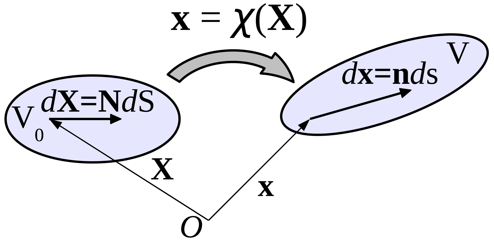
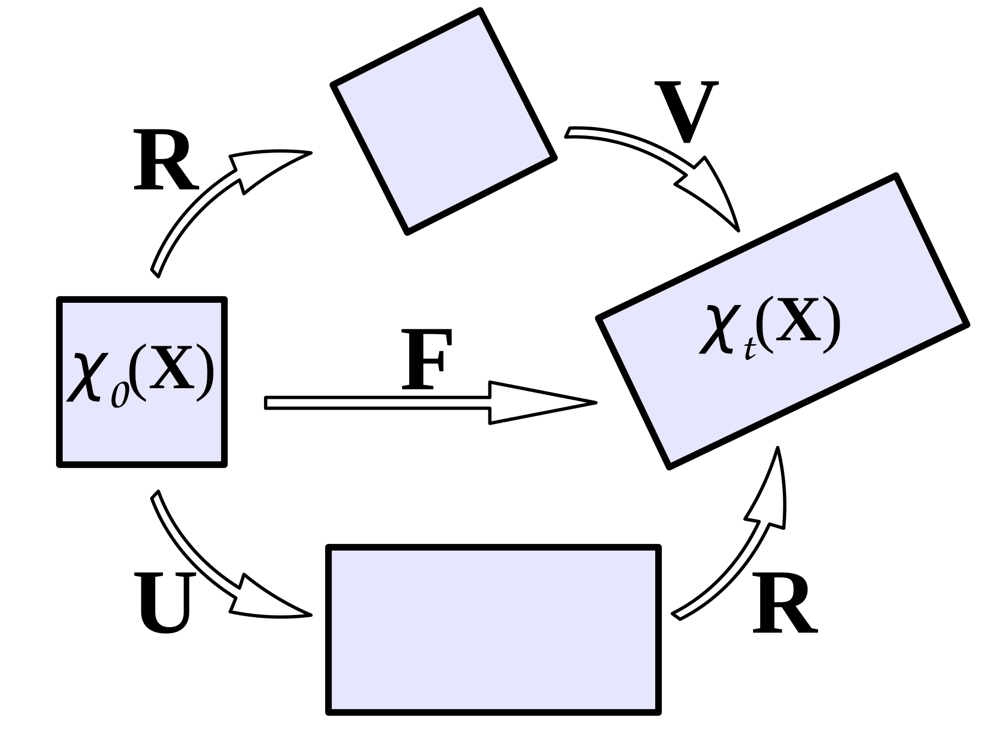
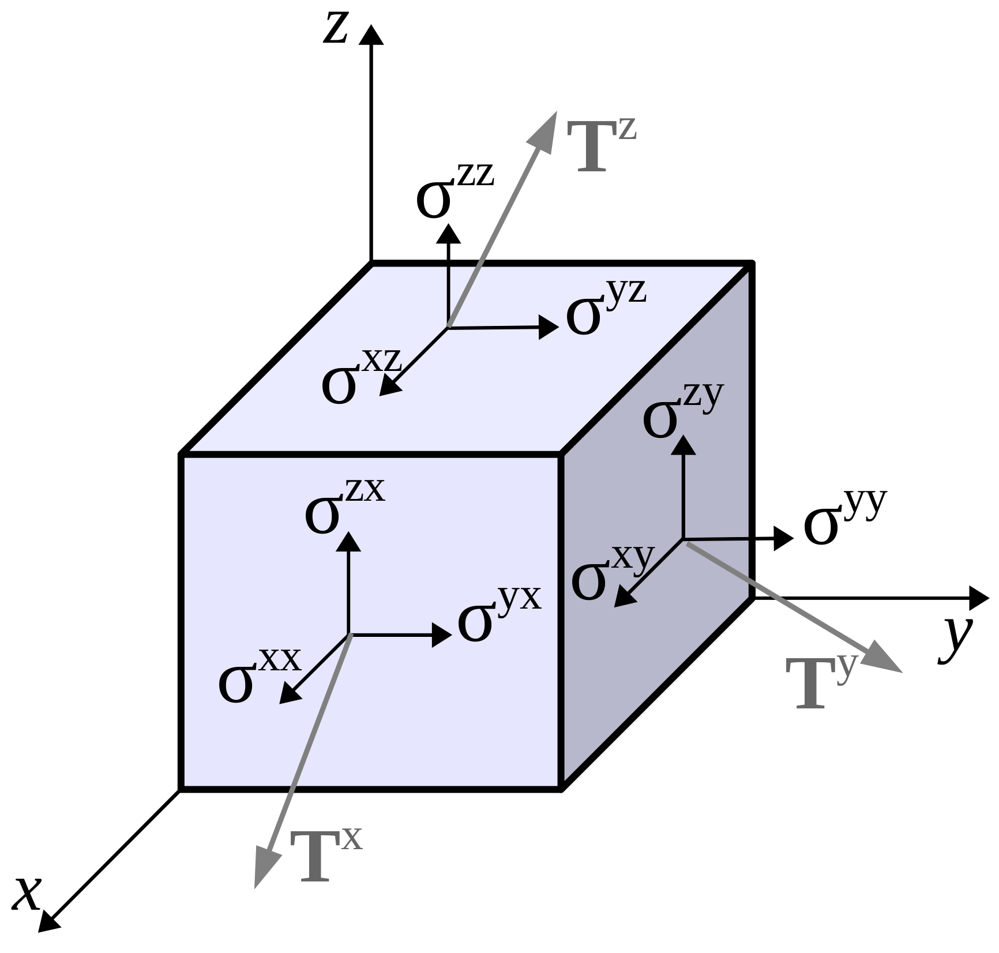

.. role:: todo

Theoretical background
======================

**Notations**

- :math:`{\bf X}` - material coordinates of a particle in reference configuration;
- :math:`{\bf x}` - material coordinates of a particle in deformed configuration;
- :math:`\chi({\bf X}, t)` - mapping from reference configuration to a deformed configuration;
- :math:`\alpha`, :math:`\beta`, :math:`\gamma` - vectors or tensors components (:math:`x`, :math:`y`, :math:`z`), superscripts;
- :math:`i`, :math:`j` - particle number, subscript;
- :math:`{\bf T}` - force vector;
- :math:`A` - area;
- :math:`{\bf F}=\{F^{\alpha\beta}\}` - deformation gradient tensor;
- :math:`J=det{\bf F}` - determinant of deformation gradient tensor, change in unit volume;
- :math:`{\bf C}=\{C^{\alpha\beta}\}` - Green's (Cauchy-Green) deformation tensor;
- :math:`{\bf E}=\{E^{\alpha\beta}\}` - strain tensor;
- :math:`{\bf U}=\{U^{\alpha\beta}\}` - right stretch tensor;
- :math:`{\bf R}=\{R^{\alpha\beta}\}` - rotation tensor;
- :math:`{\bf \sigma}=\{\sigma^{\alpha\beta}\}` - stress tensor (Cauchy);
- :math:`{\bf P}=\{P^{\alpha\beta}\}` - first Piola-Kirchhoff stress tensor;
- :math:`{\bf S}=\{S^{\alpha\beta}\}` - second Piola-Kirchhoff stress tensor;
- :math:`{\bf K}=\{K^{\alpha\beta}\}` - Kirchhoff stress tensor;
- :math:`{\bf B}=\{B^{\alpha\beta}\}` - second Biot (Jaumann) stress tensor;

Deformation in continuum mechanics is the transformation of a body from a reference configuration to a current configuration. Consider a material body, which is a set of elements, called particles and in a chosen reference configuration each particle is identified by the position vector :math:`{\bf X}`. The components of :math`{\bf X}` in the chosen reference frame are called *material coordinates*. Mapping :math:`{\bf \chi}` from one configuration to another is called *deformation of the body*. Let :math:`{\bf x}` to be a position of the particle in the deformed configuration, such that :math:`{\bf x}={\bf \chi}({\bf X})`. At any different time, the body may occupy different configurations so that a material paricle occupies a series of point in space. A smooth sequence of configurations in time describes a motion of the body [Dill2006]_.

   **Figure 1:** Schematic of the body transformation from reference configuration (right) with position vector :math:`{\bf X}` to the deformed configuration (left) with position vector :math:`{\bf x}` occuring under smooth mapping :math:`{\bf \chi}`.

*Strain* is a description of deformation in terms of relative displacement of particles in the body. Depending on the amount of strain, or local deformation, the analysis of deformation is subdivided into three deformation theories:

- Finite strain theory (large strain theory) deals with deformations in which both rotations and strains are arbitrarily large. In this case, the undeformed and deformed configurations of the continuum are significantly different and a clear distinction has to be made between them. This is commonly the case with elastomers, plastically-deforming materials and other fluids and biological soft tissue.

- Infinitesimal strain theory (small strain theory) - strains and rotations are both small. In this case, the undeformed and deformed configurations of the body can be assumed identical. The infinitesimal strain theory is used in the analysis of deformations of materials exhibiting elastic behavior, such as materials found in mechanical and civil engineering applications, e.g. concrete and steel.

- Large-displacement or large-rotation theory, which assumes small strains but large rotations and displacements.

In a body that is not deformed, the arrangement of the molecules corresponds to a state of thermal equilibrium, meaning that, if some portion of the body is considered, the resultant of the forces on that portion is zero. When a deformation occurs, the arrangement of the molecules is changed, and the body ceases to be in its original state of equiliubrium. Forces therefore arise which tend to return the body to equilibrium. These internal forces which occur when a body is deformed are called *internal stresses*. If no deformation occurs, there are no internal stresses [Landau1970]_. 

Quantitatively, stress at a point :math:`A` in a body is defined as 

.. math::
   \sigma = \lim_{\Delta A \to 0}\frac{\Delta {\bf T}}{\Delta A}
   :label: eqstress2

where :math:`\Delta A` is the area, surrounding the point A and :math:`\Delta {\bf T}` is acting force. The stress :math:`\sigma` is a measure of the average force per unit area of a surface within the body on which internal forces act. 

The stresses considered in continuum mechanics are only those produced during the application of external forces and the consequent deformation of the body; that is to say, *relative changes in deformation are considered rather than absolute values*. A body is considered stress-free if the only forces present are those inter-atomic forces (ionic, metallic, and van der Waals forces) required to hold the body together and to keep its shape in the absence of all external influences, including gravitational attraction. This assertion is not valid in cases where the deformation of the body results in macroscopic electric fields in it, so we will not discuss such bodies in futher. 

.. _theorStrain:

Strain
------

A strain is a normalized measure of deformation representing the *displacement between particles in the body relative to a reference length*. It is in general a tensor quantity. Physical insight into strains can be gained by observing that a given strain can be decomposed into *normal* and *shear* components. The amount of stretch or compression along a material line elements or *fibers* is the normal strain, and the amount of distortion associated with the sliding of plane layers over each other is the shear strain, within a deforming body. This could be applied by elongation, shortening, or volume changes, or angular distortion. Strains are dimensionless and are usually expressed as a decimal fraction, a percentage or in parts-per notation. Strains measure how much a given deformation differs locally from a rigid-body deformation. 

Consider a particular point :math:`{\bf X}` and a neighboring point of the reference configuration are connected by the vector :math:`d \bf X`. The direction of the fiber is given by unit vector :math:`{\bf N}` and its length is :math:`dS`, such that :math:`d{\bf X}={\bf N}dS`. After deformation, the particle moves to the place :math:`{\bf x}` and the material fiber **rotates** and **elongates** to the deformed position :math:`d \bf x={\bf n}ds`. The deformed fiber is determined by the deformation:

.. math::
   d{\bf X} = {\bf F} \cdot d{\bf X}
   :label: eqstrain3

where

.. math::
   {\bf F} = \frac{\partial {\bf x(X)}}{\partial \bf X}
   :label: eqstrain4

Tensor :math:`{\bf F}` is called the *deformation gradient*. The deformation gradient at a point completely determines the rotation and the change in the length of any fiber of material emanating from this point. 

Let us consider a pair of fibers :math:`d_1 {\bf X}` and :math:`d_2 {\bf X}`, which are deformed to :math:`d_1 {\bf x}` and :math:`d_2 {\bf x}`, then we have:

.. math::
   d_1{\bf x} \cdot d_2{\bf x} = d_1{\bf X} \cdot {\bf C} \cdot d_2{\bf X}
   :label: eqstrain5

According to Eq. :eq:`eqstrain4`

.. math::
   {\bf C} = {\bf F}^\tau \cdot {\bf F}
   :label: eqstrain6

The tensor :math:`{\bf C}` is a function of :math:`{\bf X}` that is called the *deformation tensor* or also *Cauchy-Green tensor* or *Green's deformation tensor*.

Suppose that :math:`d_1 {\bf X}=d_2 {\bf X}=d {\bf X}`. The *stretch* :math:`\alpha` is the ration of the deformed length to the initial length:

.. math::
   ds = \alpha dS
   :label: eqstrain7

The stretch is therefore a positive number, equal to 1 for no change in the length, greater that 1 for an increase in length, and less than 1 for shortening of the fiber. The change in length divided by the reference length is the *extension* or *normal strain*, equal to :math:`\alpha-1`, then

.. math::
   \alpha^2 = {\bf N} \cdot {\bf C} \cdot {\bf N}
   :label: eqstrain8

From Eqs. :eq:`eqstrain7` and :eq:`eqstrain3`:

.. math::
   \alpha {\bf n} = {\bf F} \cdot {\bf N}
   :label: eqstrain9

Next, consider two fibers that are initially perpendicular to each other. Let :math:`\gamma` denotes the change in angle between the fibers upon deformation, positive for a decrease in angle. The angle between deformed fibers is :math:`\pi/2-\gamma`, so we call :math:`\gamma` the *shear* or *shear strain* on the fibers. From Eq. :eq:`eqstrain5`:

.. math::
   \alpha_1 \alpha_2 sin\gamma = {\bf N_1} \cdot {\bf C} \cdot {\bf N_2}
   :label: eqstrain10

The deformation tensor :math:`{\bf C}` at :math:`{\bf X}` determines the stretch of any fiber at :math:`{\bf X}` with given direction :math:`{\bf N}` (Eq. :eq:`eqstrain8`), at the same time :math:`{\bf C}` also determines the shear of any pair of orthogonal fibers at :math:`{\bf X}` (Eq. :eq:`eqstrain10`). Therefore, strain of the body at :math:`{\bf X}` is completely determined by :math:`{\bf C}`. When :math:`{\bf C}={\bf 1}`, no strain of fibers at :math:`{\bf X}` occurs. For material characterization, it is sometimes more convenient to have a measure of strain called *strain tensor*, which is zero when no strain occurs. One such strain is :math:`{\bf E}=\frac{1}{2}({\bf C} - {\bf 1})`.

The choice of strain measure is arbitrary. In practice, it is decided by the simplicity of the mathematical formulation of the convenience in correletion with experiments on a particular material. *Any symmetric tensor that is one-to-one correspondence with the stretch :math:`{\bf U}` (see definition below) and is zero for no deformation can be used as a strain measure*:

.. math::
   {\bf E} = f({\bf U}), f({\bf 0}) = {\bf )}, {\bf U} = f^{-1}({\bf E})
   :label: eqstrain12

For example, a general formula for *Lagrangian strain tensors* is:

.. math::
   {\bf E}_m = \frac{1}{2m}({\bf U}^{2m} - {\bf 1})
   :label: eqstrain13

for different values of :math:`m` we can get:

.. math::
   \begin{split}
   &{\bf E}_{(1)} = \frac{1}{2}({\bf U}^2 - {\bf 1}) = \frac{1}{2}({\bf C} - {\bf 1}) \text{ - Green's strain tensor} \\
   &{\bf E}_{(1/2)} = ({\bf U} - {\bf 1}) \text{ - Biot (engeneering) strain tensor} \\
   &{\bf E}_{(0)} = ln({\bf U}) \text{ - Logarithmic (natural, true, Hencky) strain tensor}
   \end{split}
   :label: eqstrain14

Now, consider three fibers at :math:`{\bf X}` that are not collinear and make a right-handed system. The volume of the parallelepiped with these three adjacent edges in undeformed configuration is :math:`dV_0=[d_1{\bf X}, d_2{\bf X}, d_3{\bf X}]`. The bracket notation here denores the scalar triple product. In deformed configuration the there fibers determine the volume of deformed volume element :math:`dV=[d_1{\bf x}, d_2{\bf x}, d_3{\bf x}]`. Using Eq. :eq:`eqstrain3` for each fiber, we have:

.. math::
   dV = det{\bf F}~dV_0
   :label: 

If consider only deformations for which the volume is never decreased to zero (:math:`J \equiv det{\bf F} > 0`) then the deformation gradient :math:`{\bf F}` is non-singular tensor and the inverse tensor :math:`{\bf F^{-1}}` exists. By the polar decomposition theorem, there exists a *rotational tensor* :math:`{\bf R}` and positive defined symmetric *right and left stretch tensors* :math:`{\bf U}` and :math:`{\bf V}`, respectively, such that

.. math::
   \begin{split}
   {\bf F} = {\bf R} \cdot {\bf U} = {\bf V} \cdot {\bf R}, \\
   {\bf U} = {\bf U^T}, det{\bf U} > 0, \\
   {\bf V} = {\bf V^T}, det{\bf V} > 0, \\ 
   {\bf R^{-1}} = {\bf R^T}, det {\bf R} = +1
   \end{split}
   :label: eqstrain16

The tensor :math:`{\bf U}` is called *right stretch tensor* and :math:`{\bf V}` is called *left stretch tensor*. The representation in Eq. :eq:`eqstrain16` is a decomposition of the deformation gradient into a stretch :math:`{\bf U}` followed by rotation :math:`{\bf R}`, or a rotation :math:`{\bf R}` is followed by stretch :math:`{\bf V}`. It follows from Eq. :eq:`eqstrain6` that

.. math::
   {\bf C} = {\bf U^2}, {\bf U} = {\bf C^{1/2}}
   :label: eqstrain17

   **Figure 2:** Schematic representation of the polar decomposition of the deformation gradient. The reference (undeformed) configuration is :math:`\chi_{0}({\bf X})`, the deformed configuration in a moment :math:`t` is :math:`\chi_{t}({\bf X})`.

For the further reading see [Dill2006]_.

.. _theorStress:

Stress
------

Let us consider the total force acting on some portion of the body. Firstly, this total force is equal to the sum of all the forced on all the volume elements in that portion of the body, i.e. it can be written as the volume integral :math:`\int {\bf T}dV`, where :math:`{\bf T}` is the force per unit volume and :math:`{\bf T}dV` is the force on the volume element :math:`dV`. Secondly, the forces with which various parts of the portion considered act on one another are canceled by Newton's third law and, therefore, give zero in the total resultant force. Thus, the required total force can be regarded as the sum of the forces exerted on the given portion of the body by the portion surrounding it.

Hence, for any portion of the body, each of three components :math:`\int {\bf T^{\alpha}}dV` of the resultant of all the internal stresses can be transformed into an integral over the surface. According to divergence theorem, the integral of a scalar over an arbitrary volume can be transformes into an integral over the surface  if the scalar is the divergence of a vector. In the present case we have the integral of a vector, then the vector :math:`T^{\alpha}` must be the divergence of a tensor of rank two, i.e. be of the form :math:`T^{\alpha}={\partial \sigma^{\alpha\beta}}/{\partial x^{\beta}}`. Then the force on any volume can be written as an integral over the closed surface bounding that volume:

.. math::
   \int {T^{\alpha} dV} = \int{\frac{\partial \sigma^{\alpha\beta}}{\partial x^{\beta}} dV} = \oint{\sigma^{\alpha\beta} dn^{\beta}}
   :label: eqstress1

where :math:`dn^{\beta}` are the component of the surface element vector :math:`d{\bf n}`, directed along the outward normal. 

The tensor :math:`\sigma^{\alpha\beta}` is called the *stress tensor*. As we see from Eq. :eq:`eqstress1`, :math:`\sigma^{\alpha\beta}dn^{\beta}` is the :math:`\alpha`-th component of the force :math:`{\bf T}` acting on the surface element :math:`d{\bf n}`. By taking elements of area in the planes of :math:`xy`, :math:`yz`, :math:`xz`, we find that the component :math:`\sigma^{\alpha\beta}` of the stress tensor is the :math:`\alpha`-th component of the force acting on a unit area perpendicular to the :math:`x^{\beta}`-axis [Landau1970]_.

   **Figure 3:** The components of the stress vector on a coordinate surface are equal to three components of the stress tensor, such that the first index corresponds to the direction on the component and the second index identifies the direction of surface.

Depending on the orientation of the plane under consideration, the stress vector may not necessarily be perpendicular to that plane, i.e. parallel to :math:`{\bf n}`, and can be resolved into two components:

- one component normal to the plane, called *normal stress*: 

.. math::
   \sigma_{\bf n} = \lim_{\Delta A \to 0}\frac{\Delta T_{\bf n}}{\Delta A} = {\bf \sigma} \cdot {\bf n} = \sum_{\alpha,\beta}{\sigma^{\alpha\beta}n^{\alpha}n^{\beta}}
   :label: eqstress10

where :math:`\Delta T_n` is the normal component of the force :math:`\Delta {\bf T}` to the differential area :math:`\Delta A` (see Eqs. :eq:`eqstress2` and :eq:`eqstress1`).

- and the other component parallel to this plane, called the *shear stress*:

.. math::
   \tau_{\bf n} = \lim_{\Delta A \to 0}\frac{\Delta T_{\bf s}}{\Delta A}  = \sqrt{{\bf \sigma}^{2} - {\bf \sigma_{n}}^2} = \sqrt{\sum_{\alpha, \beta, \gamma}{\sigma^{\alpha\beta} \sigma^{\alpha\gamma} n^{\beta} n^{\gamma}}}
   :label: eqstress11

where :math:`\Delta T_s` is the tangential component of the force :math:`\Delta {\bf T}` to the differential surface area :math:`\Delta A` (see Eqs. :eq:`eqstress2` and :eq:`eqstress1`). The shear stress can be further decomposed into two mutually perpendicular vectors.

Consider a body in reference state and deformed state. Let :math:`dA{\bf N}` denotes a unit area with normal vector :math:`{\bf N}` in reference state and :math:`da{\bf n}` denotes the same unit area in deformed state with the normal vector :math:`{\bf n}`. Let :math:`{\bf dT}` be the differential force vector that represents the resultant of the total internal forces acting on :math:`da` in deformed state. According to Eqs. :eq:`eqstress2` and :eq:`eqstress1`, we can define force :math:`\Delta {\bf T}` and unit area :math:`\Delta A` in arbitrary way and evaluate several measures of stress:

- *Cauchy stress* (:math:`{\bf \sigma}`) is the most commonly used measure of stress (also is called true stress tensor), which is defined as force in deformed configuration per unit area in deformed configuration: 

.. math::
   {\bf dT} = ({\bf n}da) \cdot {\bf \sigma}
   :label: eqstress4

The Cauchy stress tensor is used for stress analysis of material bodies experiencing small deformations where the differences in stress distribution in most cases can be neglected. The Cauchy stress tensor is symmetric.

- *First Piola-Kirchhoff stress* (:math:`{\bf P}`) is the measure of stress defined as force in deformed configuration per unit area in reference configuration:

.. math::
   \begin{split}
   &{\bf dT} = (dA{\bf N}) \cdot {\bf P},\\
   &{\bf P} = J {\bf F}^{-1} \cdot {\bf \sigma}
   \end{split}
   :label: eq:eqstress5

The first Piola-Kirchhoff stress tensor is used for stress analysis of material bodies experiencing large deformations. Like deformation gradient :math:`{\bf F}`, the first Piola-Kirchhoff tensor is unsymmetric two-point tensor.

- *Second Piola-Kirchhoff stress* (:math:`{\bf S}`)} is the measure of stress defined as modified force in deformed configuration (:math:`{\bf d\hat T}`) per unit area in reference configuration. The purpose of this is that the second Piola-Kirchhoff stress tensor will now be a symmetric tensor:

.. math::
   \begin{split}
   &{\bf d\hat T} = {\bf F}^{-1} \cdot {\bf dT}, \\
   &{\bf d\hat T} = (dA{\bf N}) \cdot {\bf S}, \\
   &{\bf S} = J {\bf F}^{-1} \cdot {\bf \sigma} \cdot {\bf F}^{-T}
   \end{split}
   :label: eq:eqstress6

If the material rotates without a change in stress state (rigid rotation), the components of the first Piola-Kirchhoff stress tensor will vary with material orientation, but the components of the second Piola-Kirchhoff stress tensor remain constant, irrespective of material orientation. For infinitesimal deformations or rotations, the Cauchy and Piola-Kirchhoff tensors are identical. 

- *Kirchhoff stress tensor* (:math:`{\bf K}`) is a scalar multiple of the Cauchy stress tensor :math:`{\bf \sigma}`. The scalar factor is the determinant of deformation gradient tensor, :math:`{\bf F}`:

.. math::
   {\bf K} = J {\bf \sigma}
   :label: eq:eqstress7

It is used widely in numerical algorithms in metal plasticity because relates to the Cauchy stress via scalar.

- *Biot (Jaumann) stress tensor* (:math:`{\bf B}`)  is the measure of stress defined as force due to stretch only applied in the undeformed body (:math:`{\bf d\hat T}`) per unit undeformed area.

.. math::
   \begin{split}
   &{\bf d\hat T} = {\bf R}^{-1} \cdot {\bf dT}, \\
   &{\bf d\hat T} = (dA{\bf N}) \cdot {\bf B}, \\
   &{\bf B} = J {\bf F}^{-1} \cdot {\bf \sigma} \cdot {\bf R} = J {\bf F}^{-1} \cdot {\bf \sigma} \cdot {\bf F}^{-T} \cdot {\bf U}
   \end{split}
   :label: eqstress8

where :math:`{\bf R}` and :math:`{\bf U}` is a rotational and rigth stretch components respectively of deformation gradient tensor due to polar decomposition (see Eq. :eq:`eqstrain16`). Biot stress tensor is used in combination with Biot (engeneering) strain tensor [Dill2006]_, [Bonet2008]_.

.. _numerAppr:

Numerical approaches
====================

The calculations of stress and strain tensors of a biological particle are based on the coarse-grained representation of the molecule, described by *Self-Organized Polymer (SOP) model*. That is, the molecule is described by one or two interacting centers (:math:`C_\alpha`'s only or :math:`C_\alpha` and :math:`C_\beta`) and total potential energy is follow

.. math::
   U_{SOP} = U_{FENE} + U_{NB}^{ATT} + U_{NB}^{REP}
   :label: usop

The details of the SOP model, as well as complete explanation of how to use SOP-GPU package can be found in `SOP-GPU documentation <http://sop-gpu.readthedocs.org/>`_.

.. _numerStrain:

Strain
------

Because strain is fundamentally a continuum quality, its computation from atomic displacement data requires either interpolation of a continuous displacement field (:math:`\chi({\bf X})`) or discretization of the deformation gradient tensor (:math:`{\bf F}`). Here we go with the second way.

**To calculate an atomic deformation gradient tensor** (:math:`{\bf F_i}`) we utilized the approach purposed by Horstemeyer and Baskes [Horstemeyer1999]_ and improved by Gullete et al. [Gullett2008]_. The deformation gradient tensor emerges from a weighted least squares optimization of local deformation data. In an arbitrary atomic system, the deformation in the neighborhood of atom :math:`i` is characterized by the changes in the relative position of its neighbors. Let atom :math:`i` is located at the position :math:`{\bf X}_i` in reference configuration and position :math:`{\bf x}_i` in deformed configuration. The relative position of neighboring atom :math:`j` is given by the vector :math:`\Delta {\bf X}_{ij}={\bf X}_{j}-{\bf X}_{i}` in reference configuration and by :math:`\Delta {\bf x}_{ij}={\bf x}_{j}-{\bf x}_{i}` in deformed configuration. Here the subscripts denote atom numbers, and the vectors :math:`\Delta {\bf X}_{ij}` and :math:`\Delta {\bf x}_{ij}` connect atom :math:`i` to its neighbors :math:`j`. There exists a unique linear mapping that transforms the relative position vector :math:`\Delta {\bf X}_{ij}` to :math:`\Delta {\bf x}_{ij}`:

.. math::
   \Delta {\bf x}_{ij} = {\bf F}_{i} \cdot \Delta {\bf X}_{ij} 
   :label: eqstrain18

where :math:`{\bf F}_i` is the value of the deformation gradient at atom :math:`i`. Here, Eq. :eq:`eqstrain18` defines the operation of the discrete deformation gradient at atom :math:`i` in a manner analogous to the continuum deformation gradient of Eq. :eq:`eqstrain3`,  where it maps a vector in the reference configuration to a vector in the deformed configuration. Writing Eq. :eq:`eqstrain3` for atom :math:`i` and each of its neighbors leads to a system of linear equations that, because of the freedom of the atomic motion, cannot generally be satisfied by a single mapping :math:`{\bf F}_i`. For this reason, an optimal local deformation gradient (:math:`\hat {\bf F}_i`) is sought, by calculating the mapping error between atom :math:`i` and a single neighbor :math:`j` as :math:`l^2`-norm of the difference between the :math:`\Delta {\bf x}_{ij}` and :math:`\hat {\bf F}_{i} \cdot \Delta {\bf X}_{ij}`:

.. math::
   \phi_{ij} = (\Delta {\bf x}_{ij} - \hat{\bf F}_{i} \cdot \Delta {\bf X}_{ij})^{\tau} (\Delta {\bf x}_{ij} - \hat{\bf F}_{i} \cdot \Delta {\bf X}_{ij})
   :label:

Thus, the weighted least squares error among the neighbors of :math:`i` is given by

.. math::
   \phi_{i} = \sum_{j=1}^{N}(\Delta {\bf x}_{ij} - \hat{\bf F}_{i} \cdot \Delta {\bf X}_{ij})^{\tau} (\Delta {\bf x}_{ij} - \hat{\bf F}_{i} \cdot \Delta
   :label:

where :math:`N` is the number of neighboring atoms, and :math:`w_j` is a weight factor.

This formulation takes into account the fact that local deformation at individual atoms in system are subjected to inhomogeneous deformations; thus the local deformation gradient is computed without extension of the mapping error to the bulk. The optimal deformation gradient :math:`\hat {\bf F}_{i}`, in least square sense, is obtained by minimizing :math:`\phi_{i}` with respect to components of :math:`\hat {\bf F}_{i}`.

.. math::
   \frac{\partial \phi_{i}}{\partial \hat F^{\alpha \beta}} = \sum_{j=1}^{N}(-2 \Delta x_{ij}^{\alpha} \Delta X_{ij}^{\beta} + 2 \Delta X_{ij}^{\beta} \hat F^{\alpha \gamma} \Delta X_{ij}^{\gamma}) w_j
   :label: eqstrain19

Here greek superscripts denote components of vectors :math:`\Delta {\bf X}_{ij}` and :math:`\Delta {\bf x}_{ij}` and tensor :math:`\hat{\bf F}_{i}`. Setting Eq. :eq:`eqstrain19` equal to zero and solving for the components of :math:`\hat{\bf F}_{i}` get the linear system of equations which in matrix notation can be written as

.. math::
   \hat{\bf F} {\bf D} = {\bf A}
   :label:

where :math:`{\bf D}` and :math:`{\bf A}` are :math:`3 \times 3` matricies such as

.. math::
   \begin{split}
   {\bf D} = \sum_{j}\Delta {\bf X}_{ij} \Delta {\bf X}_{ij}^{\tau} w_{j}, \\
   {\bf A} = \sum_{j}\Delta {\bf x}_{ij} \Delta {\bf X}_{ij}^{\tau} w_{j}
   \end{split}
   :label: defgradAD
   
Provided that :math:`{\bf D}` was formed from a minimum of three non-coplanar nearest neighbors having nonzero weights, the optimal discrete deformation gradient is determined as

.. math::
   \hat{\bf F} = {\bf A} {\bf D}^{-1}
   :label: defgradnum

which is *the deformation gradient of the system in current configuration with respect to reference configuration* [Gullett2008]_.

**To obtain the value of atomic stretch tensor** (:math:`{\bf U_i}`) we computed the Green's strain tensor according to Eq. :eq:`eqstrain6` and calculated square root (see Eq. :eq:`eqstrain17`) using eigenvalue decomposition of tensor :math:`{\bf C}={\bf R} {\bf \Lambda} {\bf R}^{-1}`, where {\bf R} is the matrix of eigenvectors and :math:`{\bf \Lambda}` is eigenvalue matrix. Since tensor :math:`{\bf C}` is real symmetric matix then eigenvectors and eigenvalues are defined in a real space, :math:`{\bf \Lambda}` is positive-defined and :math:`{\bf R}^{-1}={\bf R}^{\tau}` is orthogonal matrix. Then

.. math::
   {\bf U} = {\bf C}^{1/2} = {\bf R} {\bf \Lambda}^{1/2} {\bf R}^{\tau}
   :label: eqstrain21

The eigenvalues of matrix :math:`{\bf C}` (also  called *principal* values) were obtained analyticaly, writing the characteristic polynomial for an arbitrary symmetric :math:`3 \times 3` matrix:

.. math::
   M = \begin{pmatrix}
   a & d & e \\
   d & b & f \\
   e & f & c 
   \end{pmatrix}

.. math::
   \lambda ^{3} + A \lambda ^{2} + B \lambda + C = 0
   :label: eqstrain20

where coefficients are

.. math::
   \begin{split}
   &A = -(a + b + c), \\
   &B = ab + bc + ac - d^2 - e^2 - f^2,\\
   &C = abc + 2dfe - e^2b - f^2a - d^2c = det(M)
   \end{split}

are invariats of matrix (tensor), meaning that they do not change with rotation of the coordinate system. The solution of cubic equation was obtained using Viete's substitution (also Viete's triginometric formulas):

.. math::
   \begin{split}
   \lambda_1 = -2\sqrt{Q}\cos{(\phi)} - \frac{A}{3}, \\
   \lambda_2 = -2\sqrt{Q}\cos{(\phi + \frac{2}{3}\pi)} - \frac{A}{3}, \\
   \lambda_3 = -2\sqrt{Q}\cos{(\phi - \frac{2}{3}\pi)} - \frac{A}{3}
   \end{split}
   :label: eqstrain23

where

.. math::
   \phi = \frac{1}{3}\arccos{\frac{R}{\sqrt{Q^3}}}, ~Q = \frac{A^2 - 3B}{9}, ~R = \frac{2A^3 - 9AB + 27C}{54}

Since we work in the space of symmetric real matricies all the possiblel solution of the characteristic polynomial (Eq. :eq:`eqstrain20`) are real positive values (Eqs. :eq:`eqstrain23`). 

Solving problems Eqs. :eq:`eqstrain20` - :eq:`eqstrain23` for each Green's tensor :math:`{\bf C}_i` for each atom :math:`i`, we sustitute solution into Eq. :eq:`eqstrain21`) and can obtain atomic stretch tensor :math:`{\bf U}_i`. We can calculate different atomic strain tensors :math:`{\bf E}_i` using Eqs. :eq:`eqstrain13`.

.. _numerStress:

Stress
------

We calculated atomic stress using forlmulas, widely utilized to measure atomic stress in crystals ([Basinski1971]_, [Cormier2001]_, [Delph2005]_) and proteins ([Ishikura2012]_), according to which

.. math::
   {\bf \sigma}_{i} = \frac{1}{2\Omega_{i}}(\sum_{j \neq i}{{\bf T}_{ij} \otimes {\bf r}_{ij}} + m_{i}{\bf v}_{i} \otimes {\bf v}_{i})
   :label: stressnum

where :math:`{\bf \sigma}_{i}` is the atomic stress tensor of atom :math:`i`, :math:`{\bf r}_{ij}={\bf x}_{j}-{\bf x}_{i}`, :math:`\otimes` represents the tensor product, :math:`{\bf T}_{ij}` is the pairwise force vector acting on atom :math:`i` from atom :math:`j`, and :math:`m_{i}`, :math:`{\bf v}_{i}` and :math:`\Omega_{i}` are the mass, velocity and volume of atom :math:`i`, respectively. In our calculations we neglect kinetic energy of an atom (second term in Eq. :eq:`stressnum`) since we consider coarse-grained representation of the molecule when all the particles have same kinetic energy term.

If consider :math:`T_{ij}^{\alpha}=-\frac{dW_{ij}(r_{ij})}{dr_{ij}}\frac{dr_{ij}^{\alpha}}{r_{ij}}`, where :math:`W_{ij}(r_{ij})` is pair potential between atom :math:`i` and :math:`j`, then the stress tensor representation in component becomes:

.. math::
   \sigma_{i}^{\alpha\beta} = -\frac{1}{2\Omega_{i}}\sum_{j \neq i}{\frac{dW_{ij}(r_{ij})}{dr_{ij}} \frac{r_{ij}^{\alpha}r_{ij}^{\beta}}{r_{ij}}}
   :label: eqstress3

The question arises how calculate the atomic volume :math:`\Omega_{i}`. This is the point which separates all the numerical formulations of stress measure provided previously ([Hardy1982]_, [Cormier2001]_) and it can be calculated in different ways. In our calculation, for each atom we considered it interacting in pairwise way with other particles within the certain cut-off radius. Then we found so-called "effective volume" originated from these pairs:

.. math::
   \Omega_{i} = \frac{4 \pi}{3}a_{i}^{3},~\text{where}~a_{i} = \frac{\sum_{j \neq i}{r_{ij}^{-1}}}{2 \sum_{j \neq i}{r_{ij}^{-2}}}
   :label:

here :math:`r_{ij}` is the distance between two particles within a chosen cut-off. For our coarse-grained tensors the values for :math:`a_i \approx 3.1-3.9` Å, corresponding to a covalent :math:`C_\alpha-C_\alpha` bond length. 

The Eq. :eq:`eqstress3` in the present form corresponds to the local atomic Cauchy stress. In order to obtain any other stress measures one can use the Eqs. :eq:`eqstress4` - :eq:`eqstress8`. Another way, showed by Delph ([Delph2005]_), to obtain second Piola-Kirchhoff stress tensor using formula:

.. math::
   P_{i}^{\alpha\beta} = -\frac{1}{2\Omega_{i}}\sum_{j \neq i}{\frac{dW_{ij}(r_{ij})}{dr_{ij}} \frac{R_{ij}^{\alpha}R_{ij}^{\beta}}{R_{ij}}}
   :label:

where :math:`{\bf R_{ij}}={\bf X}_j-{\bf X}_i` - the distance between particles in reference confuguration.

The Eq. :eq:`eqstress3` were modified for a **spherical geometry** by Zandi and Reguera ([Zandi2005]_) to describe the stress measures of icosahedral shells. They derived formulas in terms of spherical basis :math:`({\bf e}_r, {\bf e}_{\phi}, {\bf e}_\theta)`, which correspond to *radial*, *azimutal* and *polar unit vectors*, respectively. According to this geometry, stress measures can be defined as follow:

.. math::
   \begin{split}
   &(\sigma_{T})_{i} = - \frac{1}{2 \Omega^{2D}} \sum_{j \neq i}{ \frac{dW_{ij}(r_{ij})}{dr_{ij}}\frac{(r_{ij} \cdot {\bf e}_{\theta})^{2} + (r_{ij} \cdot {\bf e}_{\phi})^{2}}{2 r_{ij}} } \text{ - lateral (tangential) component of stress}, \\
   &(\sigma_{\theta\phi})_{i} = - \frac{1}{2 \Omega^{2D}} \sum_{j \neq i}{ \frac{dW_{ij}(r_{ij})}{dr_{ij}}(r_{ij} \cdot {\bf e}_{\theta})(r_{ij} \cdot {\bf e}_{\phi})} \text{ - ($45^o$)-shear component of stress}, \\ 
   &(\sigma_{R})_{i} = - \frac{1}{2 \Omega^{3D}} \sum_{j \neq i}{ \frac{dW_{ij}(r_{ij})}{dr_{ij}}(r_{ij} \cdot {\bf e}_{r})^{2}} \text{ - radial component of stress}, \\
   \end{split}
   :label: eqstress9

First two stress components are defined in-plane as the projection on the spherical surface, therefore the volume element, :math:`\Omega^{2D}`, corresponding to particle is also in-plane, i.e. area. The third stress component, radial, is still three-dimentional (3D), therefore :math:`\Omega^{3D}` is atomic volume, as described above. 

.. _usingtc:

Using TensorsCalculator
=======================

The approaches described in a Section :ref:`numerAppr` are implemented in TensorsCalculator (TC) program package, which allows to calculate and visualize the distribution of a stress/strain measure on a surface of considered biological particle. There are two regimes available in TC: **tensor computing regime** and **tensor visualization regime**. Running TC requires presence of the following files:

- Structure file: file of the coarse-grained structure in *.pdb* format. 
- Topology file: file of the coarse-grained structure topology in Gromacs *.top* format (see `SOP-GPU documentation <http://sop-gpu.readthedocs.org/>`_ for details).
- Trajectory file: file of coordinates of a system in coarse-grained representation, in *.dcd* format. Note: the trajectory as well as initial *.pdb* structure should contain only the atoms of a considered biomolecule or its part (no water, ions, mica surface or tip atoms).
- If running TC just in visualization regime, tensor files *.tnsr* are also required. 

All these as well as other parameters should be specify in configuration file (see Section :ref:`inputpar`). To run TC, type in terminal::

  tensors config_file.config

The program will generate output files with the atomic tensors values arranged in *.tnsr* format or/and *.pdb* format for visualization.

.. _tnsrfile:

Format *.tnsr*
--------------

The calculated values of atomic tensors can be written out in output files, in order to use them later for visualization. Tensor values file *.tnsr* has one-to-one correspondance with *.dcd* trajectory file and each frame is separated by the word ``END``::

  -------(a)--(b)-(c)-(d)-(e)------(f)---
  ATOM      1 ALA    1 A  A1    -2.00000 ... 2.50000
  ATOM      2 ALA    2 A  A1    -3.00000 ... 3.50000
  ATOM      3 ALA    3 A  A1    -4.00000 ... 4.50000
  ...

(a): atom ID; 
(b): residue name;
(c): redidue number;
(d): chain identificator;
(e): segment identificator;
(f): tensor components;

Note: depending on calculating tensor type and the output value, there may be from 1 to 9 components, written at position (f). One component if output is scalar (energy distribution), three components is output is vector (spherical tensors disribution) and nine components if output is the second-ranked tensor, i.e. matrix (stress or strain distribution).

Tensors calculation
-------------------

Using TC one can compute the following measures: 

- Potential energy distribution: total potential energy, calculated according to Eq. :eq:`usop` for each atom in the system.
- Stress tensor distribution: Cauchy stress tensor (Eq. :eq:`eqstress4`) calculated per atom using Eq. :eq:`eqstress3`. 
- Spherical tensors distribution: stress tensor projected along the combination of spherical unit vectors, calculated per atom for an object possesing spherical geometry (Eq. :eq:`eqstress9`).
- Strain tensor distribution: calculation of the Green strain tensor (Eq. :eq:`eqstrain14`) per atom, the deformation gradient tensor (Eq. :eq:`eqstrain4`) is also calculted as intermediate using Eq. :eq:`defgradnum`. If required, atomic stretch tensor (Eq. :eq:`eqstrain16`) can be calculated within the strain tensor option using Eq. :eq:`eqstrain21`.

Tensors visualization
---------------------

If tensor files already exist, they can be visualized separately from calculation. Most of the time it is required if appropriate representation of the values is sought. Visualization regime requires presence of tensor files (see Section :ref:`tnsrfile`) as well as structure and trajectory file in order to produce output file in PDB format with multiple frames. This PDB file can be uploaded in `VMD <http://www.ks.uiuc.edu/Research/vmd/>`_ ([Humphrey1996]_) using TCL script (see Section :ref:`tclscrpt` below).

Since a tensor value has nine components, in order to obtain scalar value for visualization, TC calculates projection of the tensor on a preferred direction (normal vector). Hence, separating tensor into two components: normal and shear (Eqs. :eq:`eqstress10` and :eq:`eqstress11`, see Section :ref:`theorStress` for details). The normal vector should be specified in configuration file (see Section :ref:`inputpar` below). The normal and shear components of the tensor will be written out in *occupancy* and *beta* columns of the output PDB file, respectively. In case of potential energy distribution, the scalar atomic value will be written out in the *occupancy* column only. In case of spherical tensor, all three values of the lateral, :math:`45^o`-shear and radial stresses will be written out in *occupancy*, *beta* and *charge* columns of the PDB file, respectively. 

.. _inputpar:

Input parameters file
=====================

The TC program can work both with coarse-grained and all-atomic representations of the system and trajectory, transforming all-atom structure and trajectory into coarse-grained and saving coarse-grained trajectory file separately. However, it still requires as an input to have topology file in *.top* format, which can be obtained running ``sop-top`` utility of the `SOP-GPU package <http://sop-gpu.readthedocs.org/>`_. 

General parameters
------------------

- **name** *<protein name>*

 Type: String.

 Status: Optional.

 Purpose: Name, assigned to the protein. Used mostly for files naming.

- **structure** *<filename>*

 Type: String.

 Status: Required.

 Purpose: Path to the structure coordinates file in PDB format either in all-atom or coarse-grained representation. This coordinates are also taken as *reference* configuration for calculation of stress and strain tensors.

- **topology** *<filename>*

 Type: String.

 Status: Required.

 Purpose:  Path to the structure topology file in Gromacs-like format *.top*.

- **dcd** *<filename>*

 Type: String.

 Status: Required.

 Purpose:  Path to the trajectory coordinates file in *.dcd* format. 

- **allAtom** *<yes/no>*

 Type: Boolean.

 Status: Optional.

 Default value: No.

 Purpose: Specifies if initial srtucture and trajectory files are in all-atom representation, rather than coarse-grained. 

- **dcdCa** *<filename>*

 Type: String.

 Status: Required if **allAtom** is *on*.

 Purpose:  Path to the trajectory coordinates file in *.dcd* format saved for coarse-grained representation. 

- **initialFrame** *<frame number>*

 Type: Integer.

 Status: Optional.

 Default value: 0;

 Purpose:  Number of an initial frame to start calculations and visualization. If one performes just visualization of tensors, the **initialFrame** number should be in consistence with tensor input files initial frame.

- **frameCount** *<number of frames>*

 Type: Integer.

 Status: Optional.

 Default value: 1;

 Purpose:  Number of frames, started from the **initialFrame**, using for tensor calculation/visualization. If one performes just visualization of tensors, the **frameCount** number should be in consistence with the amount of frames in tensor input files.

- **compute** *<yes/no>*

 Type: Boolean.

 Status: Optional.

 Default value: Yes.

 Purpose: Run calculation of the tensor measures as despribed in Section :ref:`usingtc` for a structure and trajectory specified in **structure** and **dcd** respectively. 

Tensor visualization parameters
-------------------------------

- **printPDB** *<yes/no>*

 Type: Boolean.

 Status: Optional.

 Default value: Yes.

 Purpose: Create PDB files for visualization of the tensor measures as despribed in Section :ref:`usingtc` using existing tensor files *.tnsr*. 

- **average** *<string>*

 Type: "no"/"cutoffAv"/"cutoffSum"/"segmentAv"/"segmentSum".

 Status: Optional.

 Default value: "no".

 Purpose: Specifies if averaging or summation for an atom is required for better representation: average over all atoms within cut-off distance (**cutoffAv**), summation over all atoms within cut-off distance (**cutoffSum**), averaging over all atoms in each segment (**segmentAv**) and summation over all atoms in each segment (**segmentSum**). Valid only if **printPDB** is *on*.

- **normalVector** *<string>*

 Type: "endtoend"/"vector".

 Status: Required if **printPDB** is *on* .

 Default value: "vector".

 Purpose: Specifies normal vector to calculate normal and shear components of the tensor (see Secton :ref:`theorStress`). If "endtoend" the normal vector will be calculated as the end-to-end vector between two given particles.

- **normalDirection** *<x, y, z normalized coordinates>*

 Type: Vector.

 Status: Required if **normalVector** is *vector*.

 Purpose: Direction of the normal vector, using to obtain normal and shear components of the tensor.

- **end1/end2** *<residue ID>*

 Type: Integer.

 Status: Required if **normalVector** is *endtoend*.

 Purpose: Direction of the normal vector, using to obtain normal and shear components of the tensor.

Energy distribution parameters
------------------------------

- **energy** *<on/off>*

 Type: Boolean.

 Status: Optional.

 Default value: Off.

 Purpose: Switching on/off calculation/visualization of the potential energy distribution per atom (Eq. :eq:`usop`).

- **outputEnergy** *<filename>*

 Type: String.

 Status: Required if **energy** is *on*.

 Purpose:  Path to the output tensor file in *.tnsr* format with the values of the atomic potential energy. 

- **outputPDBEnergy** *<filename>*

 Type: String.

 Status: Required if **energy** is *on*.

 Purpose:  Path to the PDB output file with energy values written out in *occupancy* column. 

- **inputEnergy** *<filename>*

 Type: String.

 Status: Required if **energy** is *on* and **compute** is *off*.

 Purpose:  Path to the input tensor file in *.tnsr* format. 

- **energyScaleFactor** *<scale factor>*

 Type: Float.

 Status: Optional.

 Default value: 1.0.

 Purpose: When specified, the value written out in PDB file will be multiplied by this factor. Used for better representation big/small values, which do not fit PDB column.

Stress distribution parameters:

- **cauchyStress** *<on/off>*

 Type: Boolean.

 Status: Optional.
 
 Default value: Off.

 Purpose: Switching on/off calculation/visualization of the Cauchy stress distribution per atom (Eq. :eq:`eqstress3`).

- **outputCauchyStress** *<filename>*

 Type: String.

 Status: Required if **cauchyStress** is *on*.

 Purpose:  Path to the output file in *.tnsr* format with the components of the atomic Cauchy stress tensor. 

- **outputPDBCauchyStress** *<filename>*

 Type: String.

 Status: Required if **cauchyStress** is *on*.

 Purpose:  Path to the PDB output file with Cauchy stress tensor normal and shear components written out in *occupancy* and *beta* columns, respectively. 

- **inputCauchyStress** *<filename>*

 Type: String.

 Status: Required if **cauchyStress** is *on* and **compute** is *off*.

 Purpose:  Path to the input tensor file in *.tnsr* format. 

- **cauchyScaleFactor** *<scale factor>*

 Type: Float.

 Status: Optional.

 Default value: 1.0.

 Purpose: When specified, the value in PDB file will be multiplied by this factor. Used for better representation big/small values, which do not fit PDB column.

- **sphereStress** *<on/off>*

 Type: Boolean.

 Status: Optional.
 
 Default value: Off.

 Purpose: Switching on/off calculation/visualization of the Cauchy stress projected on spherical unit vectors (Eq. :eq:`eqstress9`).

- **outputSphereStress** *<filename>*

 Type: String.

 Status: Required if **sphereStress** is *on*.

 Purpose:  Path to the output file in *.tnsr* format with the components of the atomic Cauchy stress tensor projected into spherical unit vectors. 

- **outputPDBSphereStress** *<filename>*

 Type: String.

 Status: Required if **sphereStress** is *on*.

 Purpose:  Path to the PDB output file with the lateral, :math:`(45^o)`-shear and radial spherical stress tensor components written out in *occupancy*, *beta* and *charge* columns, respectively. 

- **inputSphereStress** *<filename>*

 Type: String.

 Status: Required if **sphereStress** is *on* and **compute** is *off*.

 Purpose:  Path to the input tensor file in *.tnsr* format. 

- **sphereScaleFactor** *<scale factor>*

 Type: Float.

 Status: Optional.

 Default value: 1.0.

 Purpose: When specified, the value in PDB file will be multiplied by this factor. Used for better representation big/small values, which do not fit PDB column.

Strain distribution parameters
------------------------------

- **strain** *<on/off>*

 Type: Boolean.

 Status: Optional.

 Default value: Off.

 Purpose: Switching on/off calculation/visualization of the Green's strain distribution per atom (Eq. :eq:`eqstrain14`).

- **outputGreenStrain** *<filename>*

 Type: String.

 Status: Required if **strain** is *on*.

 Purpose:  Path to the output file in *.tnsr* format with the components of the atomic Green's strain tensor. 

- **outputPDBGreenStrain** *<filename>*

 Type: String.

 Status: Required if **strain** is *on*.

 Purpose:  Path to the PDB output file with the normal and shear strain tensor components written out in *occupancy* and *beta* columns, respectively. 

- **inputGreenStrain** *<filename>*

 Type: String.

 Status: Required if **strain** is *on* and **compute** is *off*.

 Purpose:  Path to the input tensor file in *.tnsr* format. 

- **strainScaleFactor** *<scale factor>*

 Type: Float.

 Status: Optional.

 Default value: 1.0;

 Purpose: When specified, the value in PDB file will be multiplied by this factor. Used for better representation big/small values, which do not fit PDB column.

- **stretch** *<on/off>*

 Type: Boolean.

 Status: Optional.

 Default value: Off.

 Purpose: Switching on/off calculation/visualization of the stretch distribution per atom.

- **outputStretch** *<filename>*

 Type: String.

 Status: Required if **stretch** is *on*.

 Purpose:  Path to the output file in *.tnsr* format with the components of the atomic stretch tensor (Eq. :eq:`eqstrain21`). 

- **outputPDBStretch** *<filename>*

 Type: String.

 Status: Required if **stretch** is *on*.

 Purpose:  Path to the PDB output file with the normal and shear stretch tensor components written out in *occupancy* and *beta* columns, respectively. 

- **inputStretch** *<filename>*

 Type: String.

 Status: Required if **stretch** is *on* and **compute** is *off*.

 Purpose:  Path to the input tensor file in *.tnsr* format. 

- **stretchScaleFactor** *<scale factor>*

 Type: Float.

 Status: Optional.

 Default value: 1.0.

 Purpose: When specified, the value in PDB file will be multiplied by this factor. Used for better representation big/small values, which do not fit PDB column.

- **outputDeformGradient** *<filename>*

 Type: String.

 Status: Optional.

 Purpose:  Path to the output file in *.tnsr* format with the components of the atomic deformation gradient tensor (Eq. :eq:`defgradnum`). 

- **outputPDBDeformGradient** *<filename>*

 Type: String.

 Status: Optional.

 Purpose:  Path to the PDB output file with the normal and shear deformation gradient tensor components written out in *occupancy* and *beta* columns, respectively. 

- **inputDeformGradient** *<filename>*

 Type: String.

 Status: Optional.

 Purpose:  Path to the input tensor file in *.tnsr* format. 

- **deformGradientWeightCovalent, deformGradientWeightNative, deformGradientWeightRepulsive** *<weight factors>*

 Type: Float.

 Status: Optional.

 Default value: 1.0, 1.0, 1.0.

 Purpose: Weight factor for covalent, native and repulsive interactions, used in Eq. :eq:`defgradAD`.

.. _tclscrpt:

Example of VMD TCL script
-------------------------

This TCL script can be utilize to visualize tensors using `VMD software <http://www.ks.uiuc.edu/Research/vmd/>`_ ([Humphrey1996]_):: 

  set fname <tensorPDBOutput>.pdb
  mol new $fname waitfor all
  set all [atomselect top all]
  set frame 0
  set in [open $fname r]
  set occupancy {}
  while { [gets $in line] != -1 } {
     switch -- [string range $line 0 3] {
        END {
               $all frame $frame
               $all set user $occupancy
               set occupancy {}
               incr frame
             }
         ATOM {
                 #column numbers changed to reflect occupancy column
                 lappend occupancy [string range $line 54 60];  
              }
     }
  }

To load the script run the following command in VMD terminal window::
 
  play <script_name>.vmd

By changing the column numbers in the line ``lappend occupancy [string range \$line 54 60];`` the appropriate column of PDB file can be specified. 

.. [Dill2006] \E. H. Dill, *Continuum Mechanics: Elasticity, Plasticity, Viscoelasticity.* Germany: CRC Press, 2006.

.. [Landau1970] \L. D. Landau and E. M. Lifshitz, *Theory of elasticity.* Pergamon Press Ltd., 1970.

.. [Bonet2008] \J. Bonet and R. D. Wood, *Nonlinear Continuum Mechanics for Finite Element Analysis*. Cambridge University Press, 2008.

.. [Horstemeyer1999] \M. F. Horstemeyer and M. I. Baskes (1999) "Strain tensors at the atomic scale," *MRS Proceedings* **578**: 15–20.

.. [Gullett2008] \P. M. Gullett, M. F. Horstemeyer, M. I. Baskes and H. Fang (2008) "A deformation gradient tensor and strain tensors for atomistic simulations," *Modeling Simul. Matter. Sci. Eng.* **16** (1): 015001.

.. [Basinski1971] \Z. S. Basinski, M. S. Duesbery, and R. Taylor (1971) "Influence of shear stress on screw dislocations in a model sodium lattice," *Can. J. Phys.* **49** (16): 2160-2180.

.. [Cormier2001] \J. Cormier, J. M. Rickman, and T. J. Delph (2001) "Stress calculation in atomistic simulations of perfect and imperfect solids," *J. Appl. Phys.* **89**: 99-104.

.. [Delph2005] \T. J. Delph (2005) "Local stresses and elastic constants at the atomic scale," *Proc. R. Soc. A* **461**: 1869-1888.

.. [Ishikura2012] \T. Ishikura, T. Hatano, and T. Yamato (2012) "Atomic stress tensor analysis of proteins," *Chem. Phys. Lett.* **539-540**: 144-150.

.. [Hardy1982] \R. J. Hardy (1982) "Formulas for determining local properties in molecular dynamics simulations: Shock waves," *J. Chem. Phys.* **76** (1): 622-628.

.. [Zandi2005] \R. Zandi and D. Reguera (2005) "Mechanical properties of viral capsids," *Phys. Rev. E* **72**: 021917.

.. [Humphrey1996] \W. Humphrey, A. Dalke, and K. Schulten (1996) "VMD: visual molecular dynamics," *J. Mol. Graphics* **14** (1): 33-38.

